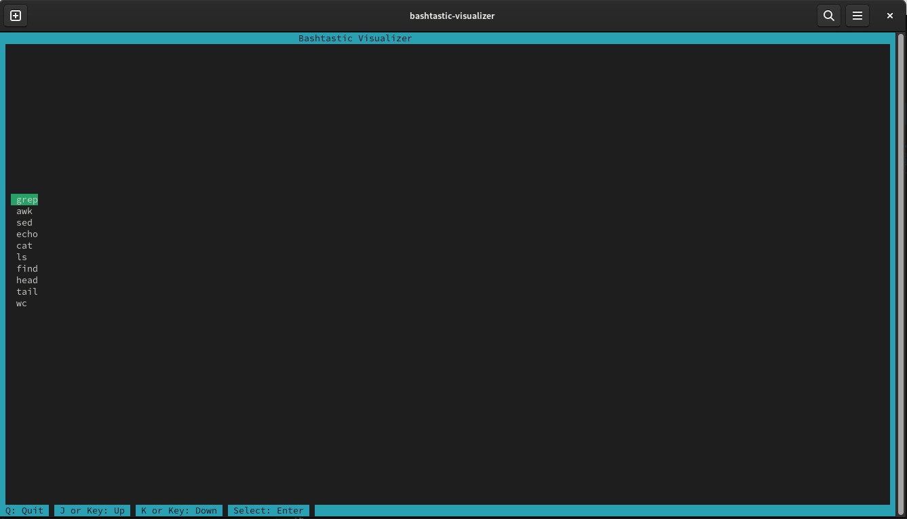

# Bashtastic Visualizer

TUI (Text User Interface) - Get Instant feedback for your `sh` commands. Explore and play with your queries 🚀.

The idea of this project is that you can get feedback on your queries, you can iterate faster than in the Terminal.

Currently stable in Linux (Debian and Ubuntu).

## Installation

This project is built with [Rust](https://www.rust-lang.org/), using [Cargo](https://doc.rust-lang.org/cargo/) as a package manager.

To install Rust and Cargo, follow the [official guide](https://www.rust-lang.org/tools/install).

Once you have Rust and Cargo installed, you can build the project:

```bash
cargo build
```
or install through crates.io

```bash
cargo install bashtastic-visualizer
```

## Usage

```bash 
cargo run
```

if installed through crates.io 

```bash 
bashtastic-visualizer
```

You can move around with the `(j, k)`, as instructed by the application. You will land on the Menu, where
you can select your query. At the moment is limited as it can be destructive to your system.



Once you select your query type, you can start adding text to it, play with it as you see fit. 

**Note**: The application will not execute the query until you press `Enter`. It executes every new Character you type.

You will be able to see the result of your query in real-time.

**PS** You can pipe 😊

Example 
------
```bash
grep todo example/example.txt | sed 's|///\(.*\)|/** \1 */|g' example.txt
```


=======================

## Recommendations

`>` can be complicated. Try not to output your text to a file, as every character you type will output a file. 
Better to run the query outside once you are sure of the results.

## Next Steps

- [ ] Add support for file exporting without destructive behavior
- [ ] Support for other OS: Windows, Mac
- [ ] Add more queries
- [ ] Add more options to the queries
- [ ] Add File System Selection
- [ ] Enabling Caching