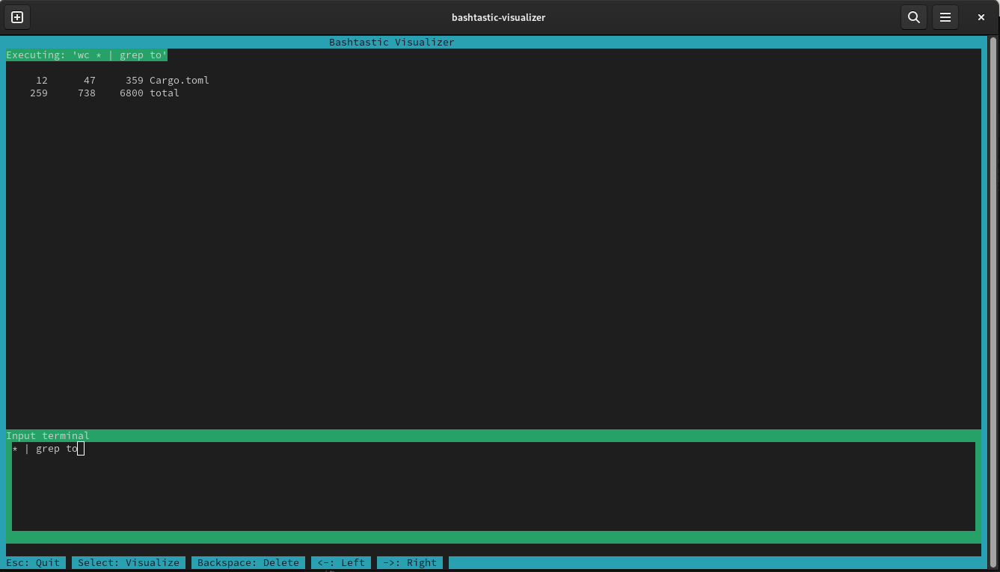

# Bashtastic Visualizer

TUI (Text User Interface) - Get Instant feedback for your `sh` commands. Explore and play with your queries 🚀.

The idea of this project is that you can get feedback on your queries, you can iterate faster than in the Terminal.

Currently stable in Linux and Mac (Debian and Ubuntu).

## Installation

This project is built with [Rust](https://www.rust-lang.org/), using [Cargo](https://doc.rust-lang.org/cargo/) as a package manager.

To install Rust and Cargo, follow the [official guide](https://www.rust-lang.org/tools/install).

Once you have Rust and Cargo installed, you can build the project:

```bash
cargo build
```
or install through crates.io

```bash
cargo install bashtastic-visualizer
```

## Usage

```bash 
cargo run
```

if installed through crates.io 

```bash 
bashtastic-visualizer
```

You can move around with the `(j, k)` or the `Arrows`, as instructed by the application. You will land on the Menu, where
you can select your query.

Supported Queries:

- [x] `cat`
- [x] `grep`
- [x] `sed`
- [x] `awk`
- [x] `echo`
- [x] `uniq`
- [x] `wc`
- [x] `head`
- [x] `tail`
- [x] `find`


Once you select your query type, you can start adding text to it, play with it as you see fit. 

**Note**: The application will not execute the query until you press `Enter`. It executes every new Character you type.

You will be able to see the result of your query in real-time.

**PS** You can pipe 😊

Example 
------
```bash
# Select grep, then type
todo example/example.txt | sed 's/todo//g' | grep 'example'
```



## Error displays

When you type something that doesn't quiet make sense, you'll see a red banner. 


---

## Using `>` to export to a file

You can use the `>` to export the result of your query to a file. Now enabled to be triggered only when you press `Enter`. When you add `>` to your query, it will stop executing the query in the terminal and will only trigger until you press the corresponding key, that way, you don't need to worry about mutliple executions at that point 😊.


## Next Steps

- [x] Add support for file exporting without destructive behavior
- [x] Support for other OS: Mac
- [x] Add more queries
- [ ] Support for other OS: Windows
- [ ] Add File System Selection
- [ ] Enabling Caching